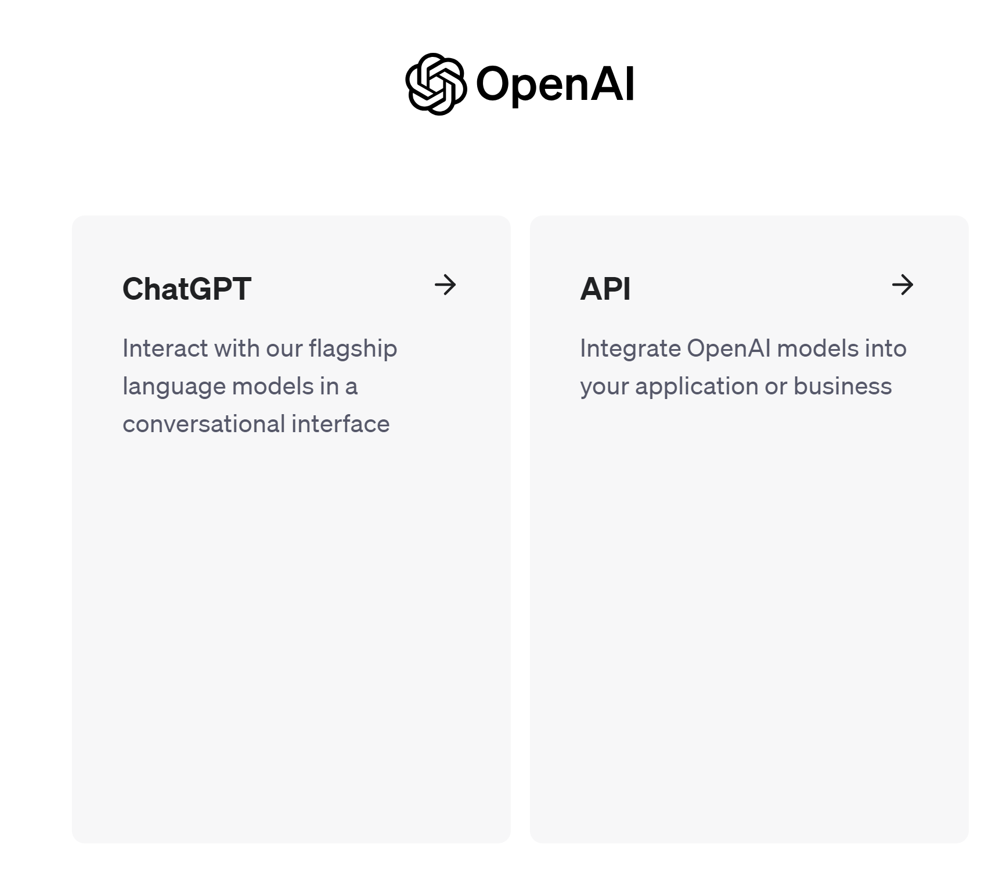
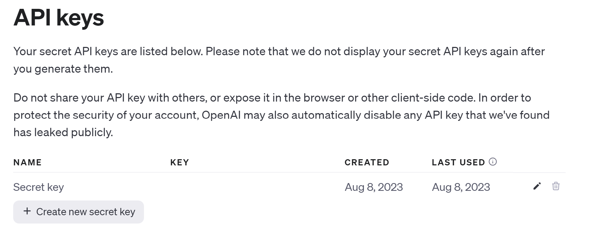
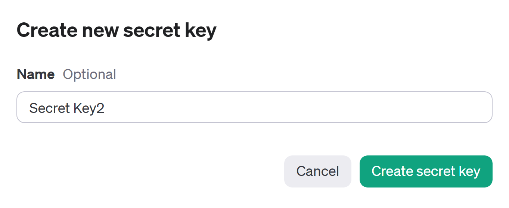
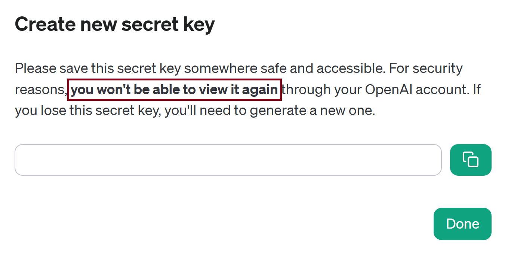

# Developing Applications with OpenAI API
These are example notebooks from Deepkearning.AI's short courses, which are available on their [website](https://www.deeplearning.ai/short-courses/).

These courses use OpenAI's API endpoint to develop applications locally, which can be run from a Jupyter Notebook.

## Setup
1. Create an account with on the (OpenAI API page)[https://openai.com/blog/openai-api], if you haven't done so already. Click on the **Sign Up** button to create a new account. If you have an account, login to your account.
2. After logging in, you should see the following page:

3. Click on the **API** section, you will see the `Welcome to the OpenAI Platform` page.
4. Click on your profile image (top right corner of page) and select `View API Keys`. You should see a page like shown below. If you have created any keys before, they will be listed here

5. Click on the `Create new secret key` button. You'll see a dialog like this, where you can provide an optional name (any unique to you name will do).

6. Click on the large `Create Secret Key` green button. You'll see this dialog:

* A new secret key (something like `sk-hjsdhjkdfhjzkdfh`) will be shown in the text box.
* **NOTE that you won't be able to view this again!**
* So click on the `Copy` button next to the textbox to copy your key and paste it into some editor.
7. In the root folder of your project create a file named `.env` and open it. Enter the following line in the file
`OPENAI_API_KEY=sk-xxxxxxxxx`
where sk-xxxxxxxxx represents the key you copied to clipboard from the OpenAI website in step 6.
8. **THIS IS VERY VERY IMPORTANT - DO NOT SHARE THIS KEY with anyone!**
9. Add `.env` to your `.gitignore` file so that it **does not** get accidentally checked into Github.

Before you can use any OpenAI API, you will need to set an environment variable called `OPENAI_API_KEY` (spelt exactly like this!). This can be done by adding the following function to your module and calling it **before** any OpenAI API call.

```python
from dotenv import load_dotenv, find_dotenv

def setupOpenaiAPIKey():
    _ = load_dotenv(find_dotenv())


if __name__ == "__main__":
    # somewhere before you make ANY 
    # OpenAI API calls
    setupOpenAPIKeys()
```

This will automatically set the `OPENAI_API_KEY` environment variable to the `sk-xxxxxxxx` value you saved in your `.env` file. That's it!

### Modules needed
You'll need to install the following modules in your Python environment (**NOTE:** the `$>` represents your command shell prompt. Do not type this!)
```shell
$> pip install openai
$> pip install tiktoken
$> pip install dotenv
```

Happy coding with LLMs!! 